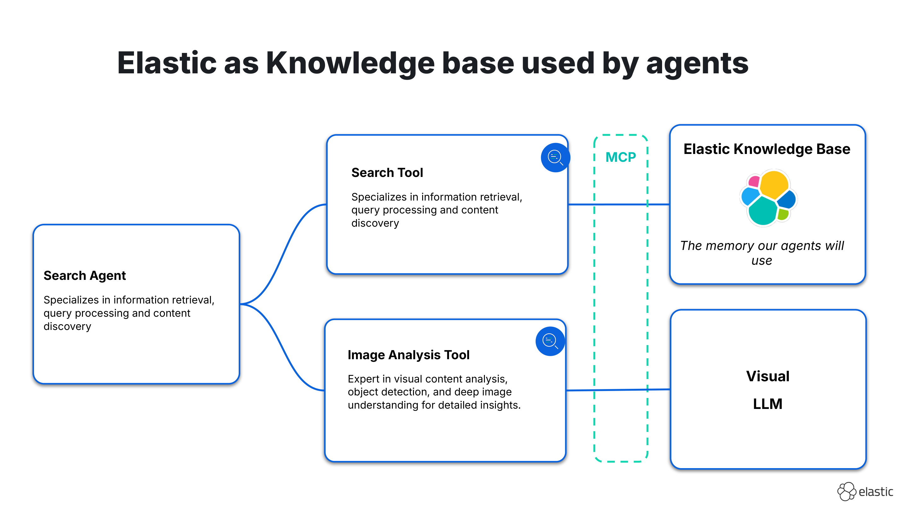
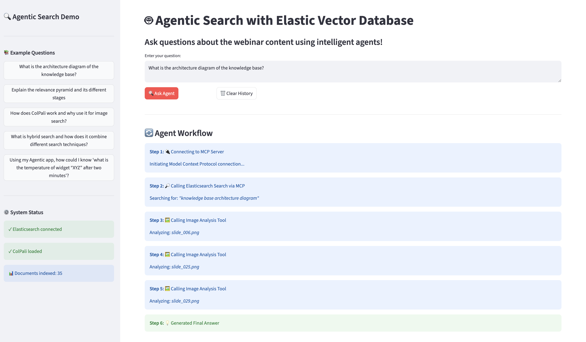
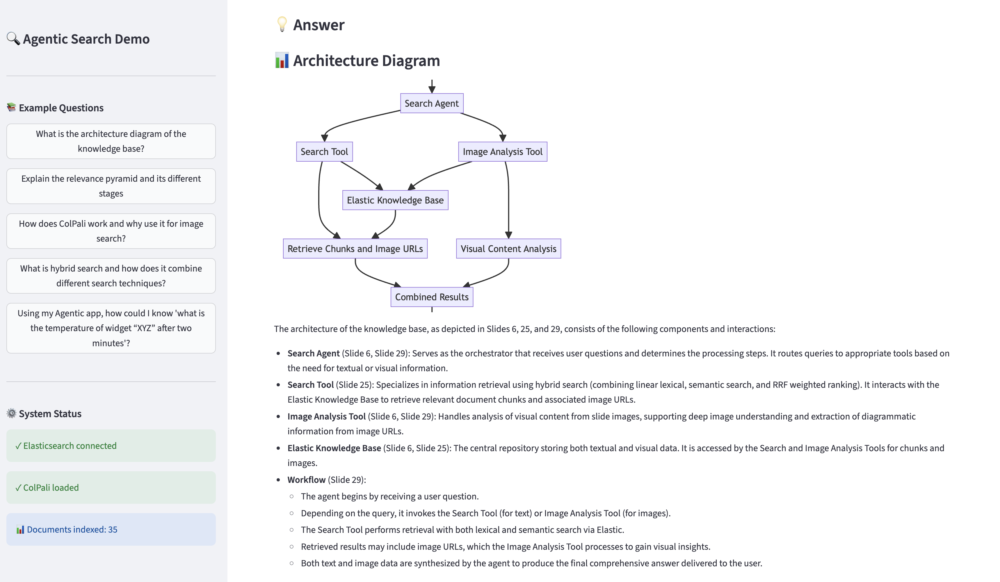

# Agentic Search with Elastic Vector Database - Demo

This demo implements an intelligent search agent that combines text search with visual analysis of technical documentation using CrewAI's multimodal capabilities.

## Architecture Overview

### Data Flow

```
1. INGESTION (ColPali for embeddings)
   PDF → Extract Slides → ColPali Encoding → Elasticsearch
   - ColPali creates multi-vector embeddings for each slide image
   - Stored in `col_pali_vectors` (rank_vectors) and `avg_vector` fields

2. SEARCH (Hybrid retrieval)
   User Query → ColPali Query Vectors → Hybrid Search (BM25 + Semantic + Vector)
   - Uses RRF (Reciprocal Rank Fusion) + late interaction rescoring
   - Returns relevant slides with text content + images

3. MULTIMODAL AGENT (CrewAI with Vision LLM)
   Question + Search Results + Images → Vision-enabled Agent → Final Answer
   - ImageAnalysisTool returns image paths
   - CrewAI's multimodal crew automatically loads images from paths
   - Vision LLM sees both text context and visual content
   - Agent synthesizes comprehensive answer with citations
```

## Key Components

### ColPali (Multi-Vector Image Embeddings)
- **Purpose**: Efficient similarity search across thousands of images
- **When**: During ingestion and retrieval
- **Output**: Vector embeddings that enable finding visually similar content
- **Field types**: `rank_vectors` for late interaction, `avg_vector` for kNN

### CrewAI Multimodal Agent
- **Purpose**: Orchestrates search and visual analysis in one workflow
- **Configuration**: `multimodal=True` on Crew enables automatic image handling
- **LLM**: Vision-capable model (e.g., gpt-4o) sees both text and images
- **Tools**: 
  - `SearchTool`: Hybrid search returning text + image paths
  - `ImageAnalysisTool`: Returns verified image paths for the Vision LLM

## Requirements

- **Python**: 3.11+ (3.11.10 recommended for demo app)
- **pyenv**: (optional but recommended) For managing Python versions
- **Elasticsearch**: Serverless project (trial license applicable)
- **OpenAI API**: Access to vision-capable models (e.g., gpt-4o, gpt-4.1)

## Environment Variables

Create a `.env` file with:

```bash
ELASTIC_URL=https://your-cluster.es.region.cloud.es.io:443
ELASTIC_API_KEY=your-api-key
OPENAI_API_KEY=your-openai-key
OPENAI_BASE_URL=https://api.openai.com/v1
OPENAI_MODEL_NAME=gpt-4.1  # Must be vision-capable
```

## Running the Demo

1. Install dependencies:
   ```bash
   pip install -r requirements.txt
   ```

2. Run the notebook:
   ```bash
   jupyter notebook elastic_crewai_demo.ipynb
   ```

3. (Optional) Run the demo app: 
   ```bash
   pyenv install -s 3.11.10
   pyenv local 3.11.10

   python -m venv venv
   source venv/bin/activate
   pip install -r requirements.txt

   streamlit run demo_app.py
   ```

## Architecture

```
┌─────────────────────────────────────────────────────────────────┐
│                         USER QUERY                               │
└────────────────────────────┬────────────────────────────────────┘
                             │
                             ▼
┌─────────────────────────────────────────────────────────────────┐
│              CrewAI MULTIMODAL AGENT (Vision LLM)                │
│  - Orchestrates workflow with SearchTool & ImageAnalysisTool     │
│  - Vision LLM (gpt-4o) sees text + images automatically          │
└──────────────┬──────────────────────────────────┬────────────────┘
               │                                  │
               │ 1. Search                        │ 2. Analyze Images
               ▼                                  ▼
   ┌─────────────────────────┐      ┌─────────────────────────────┐
   │     SEARCH TOOL          │      │  IMAGE ANALYSIS TOOL         │
   │  Hybrid Elasticsearch    │      │  Returns image paths for     │
   │  - BM25 (keyword)        │      │  Vision LLM to load          │
   │  - Semantic (ELSER)      │      └─────────────────────────────┘
   │  - Vector (ColPali kNN)  │                    │
   │  - Late interaction      │                    │
   │    rescoring             │                    │
   └───────────┬──────────────┘                    │
               │                                   │
               │ Returns: text + image paths       │
               ▼                                   │
   ┌─────────────────────────────────────────────────────────────┐
   │              ELASTICSEARCH KNOWLEDGE BASE                    │
   │  ┌─────────────┐  ┌──────────────┐  ┌────────────────────┐  │
   │  │ semantic_   │  │ col_pali_    │  │ avg_vector         │  │
   │  │ text        │  │ vectors      │  │ (kNN quick filter) │  │
   │  │ (ELSER)     │  │ (rank_vectors│  │                    │  │
   │  │             │  │  + rescoring)│  │                    │  │
   │  └─────────────┘  └──────────────┘  └────────────────────┘  │
   │                                                               │
   │  Documents: Title, Content, Image Path, Metadata             │
   └─────────────────────────────────────────────────────────────┘
                             ▲
                             │
                             │ Ingestion
                             │
               ┌─────────────────────────────┐
               │  PDF → Slides → ColPali     │
               │  Multi-vector embeddings    │
               └─────────────────────────────┘
```

**Key Points:**
- **ColPali** pre-filters thousands of images efficiently using multi-vector embeddings
- **Vision LLM** analyzes the filtered results, extracting insights from diagrams and charts
- **CrewAI** orchestrates the unified workflow with `multimodal=True` 





